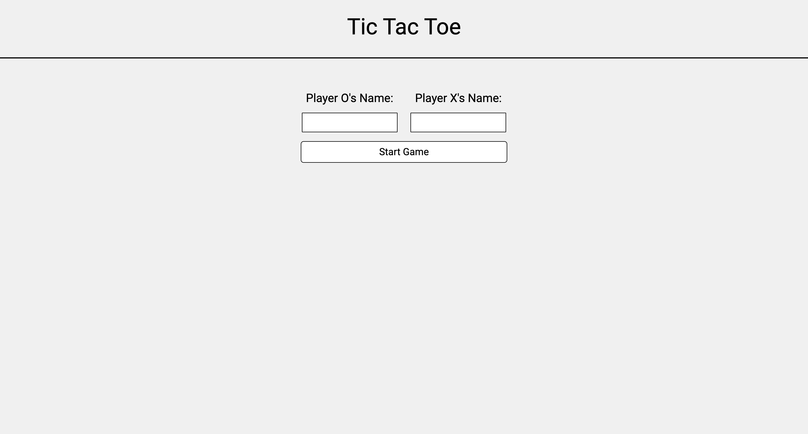
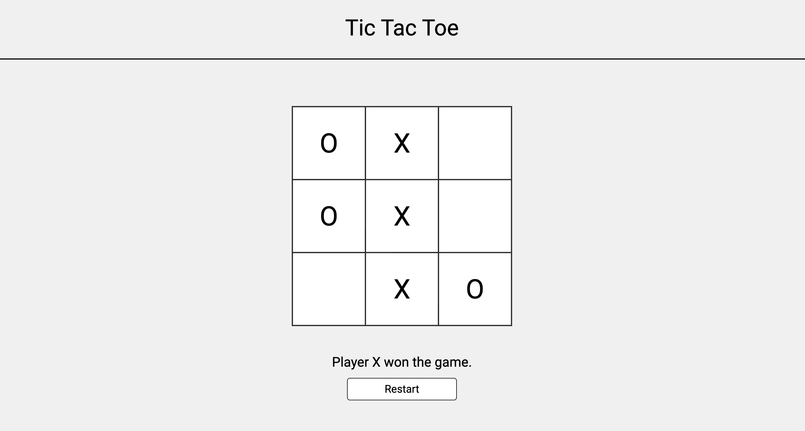

# Tic Tac Toe 

This was `tic tac toe`, the [*9th project*](https://www.theodinproject.com/lessons/node-path-javascript-tic-tac-toe) within the Odin Project curriculum and the 2nd one in the JavaScript course. This was my take on the classic tic-tac-toe game, and I implemented start, restart functionality alongside inputting player names by the user.

## Links

- [*Live Preview*](https://devvivan.github.io/odin-tic-tac-toe/)
- [*My Progress*](https://github.com/DevVivan/odin-project)

## What did this project teach me?

### HTML

- HTML forms (recap)
  
### CSS

- Adding basic responsiveness using media queries
- Using custom properties for sizing

### JavaScript

- Disabling pointer events using `.style.pointerEvents = "none";`
- Using the array `splice` method
- `Event.target`
- Organizing code using factory functions
- Organizing code using the module pattern (IIFE's)

## Images

